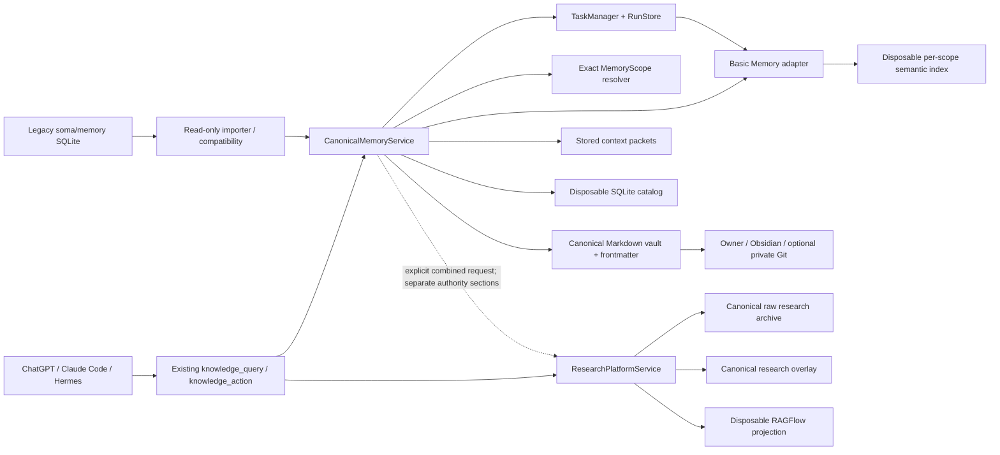

# SOMA-SHARED-MEMORY-ARCH-1 — Canonical Shared Memory Architecture

**Date:** 2026-07-28
**Status:** owner-approved and documentation-closed; `MEMORY-INTEGRATION-FOUNDATION-1` is the next implementation lane and has not started.
**Decision level:** C — foundational continuity, authority and controller-contract boundary.
**Supersedes:** the earlier assumption that the confirmed Basic Memory guard could proceed directly to controller connection.
**Provider evidence:** [`PILOT_BASIC_MEMORY_2_RESULT_2026-07-28.md`](PILOT_BASIC_MEMORY_2_RESULT_2026-07-28.md), [`BASIC_MEMORY_GUARD_1_CONFIRMATION_2026-07-28.md`](BASIC_MEMORY_GUARD_1_CONFIRMATION_2026-07-28.md)
**Related architecture:** [`SOMA_KNOWLEDGE_LAYER.md`](SOMA_KNOWLEDGE_LAYER.md), [`SCOPE_FOUNDATION_1_PRODUCTION_LANE_PROPOSAL_2026-07-27.md`](SCOPE_FOUNDATION_1_PRODUCTION_LANE_PROPOSAL_2026-07-27.md), [`task1-canonical-task-plane-evidence.md`](task1-canonical-task-plane-evidence.md)
**Machine-readable decision:** [`soma-shared-memory-architecture-decision-2026-07-28.json`](soma-shared-memory-architecture-decision-2026-07-28.json)

## Decision

Soma will expose one coherent, local-first memory system across ChatGPT, Claude Code and Hermes while retaining one clear authority:

- Soma owns memory identity, scope, lifecycle, provenance, health, context assembly, controller contracts and rebuild orchestration.
- Owner-readable Markdown is canonical memory content and canonical lifecycle metadata.
- Obsidian is the owner-facing workspace over an external private memory vault by default.
- `soma/knowledge/` is the implementation foundation for the canonical memory service because it already provides Markdown records, stable identity, ProjectScope binding, provenance, idempotency, supersession, rebuildable catalog state and health.
- `soma/memory_guard/` becomes a logical Basic Memory provider adapter beneath the canonical service. It is not a controller-facing authority.
- Basic Memory remains a replaceable, disposable local semantic and lexical retrieval provider.
- the legacy `soma/memory/` SQLite system stops accepting new canonical facts and decisions and becomes a temporary read-only compatibility/import source.
- the research platform remains a separate authority plane for raw sources, reviewed claims, evidence and research decisions.
- the first public memory contract is a named memory partition inside the existing `knowledge_query` and `knowledge_action` gateways. No new top-level gateway is added in the first lane.

## Final architecture



## Authority and component ownership

| Component | Owns | Must not own |
|---|---|---|
| MemoryScope resolver | exact project identity; later exact personal identity | memory content or retrieval ranking |
| CanonicalMemoryService | memory lifecycle, provenance, canonical writes and reads, effective state, context packets | research claims or task execution |
| external private Markdown vault | owner-readable canonical records and authoritative metadata | provider health or execution state |
| disposable SQLite catalog | rebuildable lookup, lexical projection and manifest state | canonical truth |
| Basic Memory adapter and guard | constrained provider invocation, semantic candidate retrieval, provider health evidence | canonical bodies, lifecycle, scope or public contracts |
| TaskManager and RunStore | rebuild execution, restart, cancellation, retry and result publication | memory meaning |
| context-packet store | exact assembled packet, packet identity and continuation | independent canonical memory records |
| ResearchPlatformService | source archive, claims, evidence, reviewed research decisions | ordinary owner/project-memory lifecycle |
| legacy `soma/memory/` | temporary read-only compatibility and selective import | new canonical writes |
| Git | optional private backup and owner-visible history | sole transaction or lifecycle authority |

## Public controller contract

The first lane extends the existing gateway pair rather than adding new top-level gateways.

### `knowledge_query`

Proposed named operations:

- `memory_search`
- `memory_get`
- `memory_health`
- `memory_context`
- `memory_packet_get`

### `knowledge_action`

Proposed named actions:

- `memory_save`
- `memory_supersede`
- `memory_mark_disputed`
- `memory_archive`
- `memory_rebuild_index`
- `memory_sync_provider`

Existing `search_knowledge`, `get_knowledge`, `save_knowledge`, `supersede_knowledge`, `remember_decision` and legacy local-agent memory actions become compatibility aliases or are frozen. They may not continue writing a second authority.

A later dedicated `memory_query` / `memory_action` split is permitted only after evidence shows the named partition is materially constrained. It is not part of the first lane.

## Canonical vault and record model

The production default is an owner-configured **external private Obsidian vault**, outside code repositories and outside `runs/`. The exact filesystem path remains configuration, not architecture. A disposable synthetic vault with the same shape is used for the first lane.

Recommended topology:

```text
Soma Memory/
├── personal/
│   └── <owner_id>/
├── projects/
│   └── <project_id>/
└── shared/
    └── explicitly-approved/
```

One canonical Markdown record represents one stable memory identity. Minimum authoritative frontmatter includes:

- `memory_id` and format version;
- discriminated scope identity;
- kind and authority class;
- declared lifecycle state and effective-state inputs;
- review state;
- `created_at`, `recorded_at`, `valid_from`, `valid_until` and `updated_at`;
- `supersedes_ids`;
- sources and source locators;
- controller, task and run references when applicable;
- revision and expected prior hash for compare-and-swap writes;
- idempotency key;
- an integrity hash covering body, scope, provenance and lifecycle metadata.

SQLite catalogs, relationship projections, provider databases, embeddings, scores and caches remain fully rebuildable and disposable.

## Lifecycle and temporal truth

Accepted lifecycle vocabulary:

- `proposed`
- `current`
- `superseded`
- `disputed`
- `rejected`
- `archived`

Supersession is **link-derived and crash-safe**. A replacement record containing `supersedes_ids` is sufficient to determine the predecessor's effective state. Correctness must not depend on subsequently rewriting every predecessor file.

Material meaning changes create a replacement record. Metadata-only correction uses compare-and-swap against the expected canonical hash and records a durable correction event. Hard deletion is not a normal lifecycle action.

Direct owner edits made in Obsidian are preserved. Files are classified as:

1. valid Soma canonical records;
2. unadopted owner notes — preserved and visible to the owner but excluded from authoritative controller context until adopted;
3. corrupt Soma-owned records — reported as degraded and never silently omitted.

Every successful canonical mutation advances the canonical manifest generation and marks derived catalogs and semantic indexes dirty.

## Scope model

The first lane supports project memory only through exact active ProjectScope resolution.

The durable model is a discriminated `MemoryScope`:

- `{kind: project, project_id, repo_name}` resolved through ProjectScope;
- `{kind: personal, owner_id}` resolved through a later PersonalMemoryScope sibling authority.

Personal memory is not represented as a synthetic repository project. Cross-scope retrieval must enumerate every requested scope explicitly and preserve scope origin on each result. Implicit global-memory expansion is forbidden.

Personal-memory activation, owner identity policy and real personal data are excluded from the first lane.

## Read and context flow

1. Require an explicit scope and resolve it through the authoritative scope resolver.
2. Establish canonical-vault and canonical-catalog health separately from provider health.
3. Permit semantic retrieval only when the runtime identity and exact provider generation are accepted.
4. Treat provider results only as candidate locators.
5. Reread every selected record from canonical Markdown.
6. Revalidate scope, identity, lifecycle, provenance, path and integrity hash.
7. Exclude superseded, rejected or archived records unless the request explicitly includes them.
8. Assemble and persist one exact context packet.
9. Return a bounded controller projection that identifies the stored packet and any continuation.

Published state is three-dimensional:

- canonical health: `healthy`, `dirty`, `degraded`, `empty`;
- provider health: `healthy`, `rebuilding`, `degraded`, `unavailable`, `incompatible`;
- retrieval mode: `semantic`, `catalog_lexical`, `literal_scan`, `none`.

Fallback is never silent. The response states which retrieval mode and health evidence produced the result.

## Context packet contract

A complete packet is persisted before controller-specific bounding. It includes:

- packet ID and packet hash;
- exact requested scopes and query;
- canonical and provider generations;
- retrieval mode and health;
- pinned context;
- selected memory IDs, kinds, lifecycle, validity, provenance, paths, hashes and excerpts;
- authority class for every section;
- warnings, dirty/sync state and omissions;
- byte/token budget;
- stable continuation or exact-packet retrieval reference.

ChatGPT, Claude Code and Hermes may receive different compact projections, but all projections refer to the same stored packet and the same canonical records.

## Provider and rebuild boundary

The accepted Basic Memory stack remains evidence-bound:

- Basic Memory `0.22.1`;
- FastEmbed `0.8.0`;
- `sentence-transformers/paraphrase-multilingual-MiniLM-L12-v2`;
- `litellm 1.91.4` on Windows;
- measured threshold `0.30` for the frozen pilot corpus;
- `ensure_frontmatter_on_sync = false`;
- `disable_permalinks = true`;
- `bm reindex` for rebuild.

Before semantic mode may report healthy, Soma must enforce the provider executable, version, model, threshold and configuration identity, require successful process exit before parsing output, and pass a named Windows environment allowlist rather than either an empty environment or all of `os.environ`.

A rebuild request creates a canonical task and durable run before launch. TaskManager and RunStore own execution, cancellation, retry, restart reconciliation and result publication. The provider adapter returns a bounded execution plan and never creates another lifecycle plane.

## Exact semantic-coverage gate

The current guard compares canonical-file count with provider entity count. That proves cardinality, not exact membership, and `provider_entities >= os_eligible_files` also admits stale provider entities.

`MEMORY-INTEGRATION-FOUNDATION-1` must first measure whether the accepted provider interface can expose enough information to reconcile exact canonical relative paths and hashes with an indexed generation.

- When exact reconciliation is achievable, semantic mode may become healthy only after exact manifest verification.
- When exact reconciliation is not achievable through the accepted interface, canonical lexical retrieval ships and semantic mode remains disabled or explicitly non-authoritative. Soma may not publish a stronger health claim than the provider evidence supports.

## Research boundary

Ordinary memory and reviewed research remain separate authority classes.

A saved memory note does not become a research claim, evidence item or reviewed decision. A combined context request may return separate `memory` and `research` sections with separate health, provenance and ranking. Generic compatibility labels such as `research_note` do not grant research authority.

## Legacy-memory retirement

The existing `soma/memory/` SQLite store is a competing content authority and may not remain writable after the new canonical service is active.

Retirement must include all writers and consumers, not only the public `remember_decision` operation. This includes local-agent fact, decision and validation-recipe writes and any dashboard or external-coder dependency that treats the old store as current truth.

Legacy records are handled through a bounded read-only importer. Reviewed records may be selectively migrated later; uncertain records remain quarantined or retained read-only. Bulk migration is excluded from the first lane.

## Verified blockers before controller connection

The architecture review established these production blockers in current code:

1. coverage health proves only a count; exact paths are not reconciled and `missing_paths` is never populated;
2. provider JSON and search output can be parsed without first requiring a successful exit code;
3. the frozen provider stack is documented but not runtime-enforced;
4. an absent ProjectScope store is treated as active rather than refused;
5. the provider inherits the complete ambient environment;
6. supersession writes the successor and then rewrites predecessors sequentially, so interruption can leave partial state;
7. `content_sha256` excludes authoritative lifecycle and provenance metadata;
8. the current canonical vault lives under ignored `runs/` state rather than an owner-facing Obsidian/Git location;
9. owner-authored Markdown without complete Soma frontmatter is classified as malformed rather than unadopted;
10. multiple legacy writers can still create canonical-looking memory in the old SQLite store.

The prior Basic Memory confirmation remains valid evidence for live provider behaviour, no-mutation configuration, bilingual compatibility and bounded fallback. It is not sufficient production acceptance for exact semantic completeness or controller connection.

## MEMORY-INTEGRATION-FOUNDATION-1

**Status:** accepted as the next implementation lane; implementation has not started.

### Goal

Repair the verified authority, integrity, scope, provider-health, supersession and legacy-writer defects; establish one disposable canonical vault; and prove whether exact semantic-index coverage is achievable before connecting memory to real controllers.

### Required sequence

1. repair the verified guard and canonical-lifecycle defects;
2. measure exact provider path/hash coverage capability;
3. establish one disposable external-vault-shaped canonical root for one synthetic project;
4. evolve or wrap `KnowledgeService` as `CanonicalMemoryService`;
5. add typed named memory operations to the existing knowledge gateways;
6. redirect or freeze every legacy memory writer;
7. execute provider rebuild through TaskManager and RunStore;
8. persist exact context packets with bounded projection and continuation;
9. prove one synthetic end-to-end project flow.

### Acceptance evidence

- exact project and sibling isolation;
- omitted, unknown, inactive and mismatched scope refusal before provider invocation;
- provider exit, version, model, threshold, config and environment enforcement;
- canonical save, get, lexical search, supersession, disputed/archive state and health;
- crash-safe link-derived effective supersession;
- full integrity hashing of authoritative fields;
- external edit, rename, deletion and dirty-generation handling;
- unadopted owner note versus corrupt Soma-record classification;
- exact provider manifest proof, or semantic mode disabled with honest health;
- English and Persian retrieval regression;
- provider-degraded and provider-removed canonical fallback;
- durable rebuild launch, cancellation, restart reconciliation and result publication;
- legacy aliases and local-agent paths cannot create duplicate authority;
- stored context packet, exact retrieval and stable continuation;
- memory and research remain separate in combined results;
- focused and proportional regression gates pass;
- clean worktree and no push without explicit owner instruction.

### Exclusions

No real owner-memory import, personal-memory activation, bulk legacy migration, physical `memory_guard` package relocation, dedicated new gateways, MemAgent, temporal graph provider, code-intelligence activation, research redesign, voice work, deployment or push.

### Stop conditions

Stop for owner disposition when:

- exact scope can reach the provider without authoritative scope state;
- canonical mutation or lifecycle state cannot be rebuilt from Markdown;
- the provider rewrites canonical files under the accepted profile;
- incomplete or stale semantic state can report healthy;
- exact semantic coverage is unavailable but implementation attempts to label it healthy;
- any legacy writer remains able to create a second canonical truth;
- research and ordinary memory authority are silently merged;
- implementation expands into personal data or production owner-memory import.

## Next permitted action

Implement `MEMORY-INTEGRATION-FOUNDATION-1` only. The lane does not authorize real owner-memory import, personal scope, another provider comparison, code intelligence, MemAgent, voice work, deployment or push.
