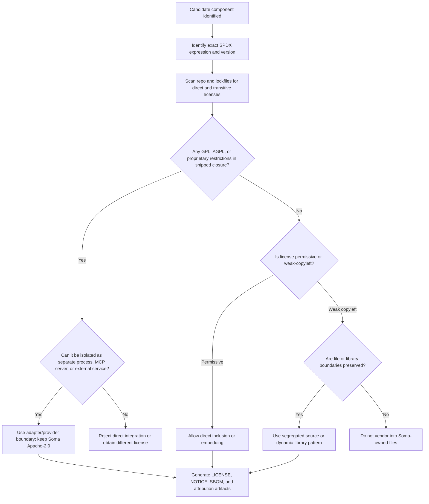

# Verifying Apache-Compatible Third-Party Integrations for Soma

## Executive summary

For Soma, the safest default policy is straightforward: **prefer Apache-2.0, MIT, BSD-2-Clause, BSD-3-Clause, ISC, and similarly permissive components for any in-process integration, vendoring, or selective source inclusion**. Those licenses generally permit inclusion in an Apache-2.0 codebase, provided you preserve the required copyright / license notices and, for Apache-2.0 inputs, any required `NOTICE` attributions. Apache-2.0 is also attractive because it includes an express patent grant and a patent-retaliation clause; MIT/BSD/ISC do not contain the same explicit patent language in their canonical texts. citeturn0search2turn19search0turn3search3turn4search0turn3search0turn3search6turn8search3

For **weak copyleft** licenses, the answer depends on the boundary. **MPL-2.0** is often workable when file boundaries are preserved, because its copyleft is file-level and it expressly allows a “Larger Work” under other terms, but copied or modified MPL-covered files remain MPL-covered. **EPL-2.0** is also more manageable than GPL-family licenses for link-only or subclass-only boundaries, but copied EPL code or new files containing EPL code become “Modified Works,” and the EPL-covered “Program” must remain available under EPL terms. **LGPL-2.1/3** can sometimes coexist with Apache-2.0 if used as a separate library—especially via a suitable shared-library mechanism—but it adds real compliance duties around notices, source for the library, relinking, and in LGPLv3 cases sometimes installation information. citeturn18search0turn18search1turn17search0turn1search3turn5search2turn5search0

For **strong copyleft** licenses, the answer is much harsher. **GPL-2.0-only, GPL-3.0, and AGPL-3.0 should be treated as incompatible with Soma’s goal of keeping the distributable Soma codebase Apache-2.0 when they are directly included, statically linked, or dynamically linked in the same program**. Apache’s own licensing guidance says Apache-2.0 code can flow into GPLv3 projects, but not the other way around for an Apache project: a combined derivative would have to be distributed under GPLv3, which defeats the goal of an Apache-2.0 distributable. GPLv2 is worse, because Apache-2.0 is not GPLv2-compatible. AGPL adds an additional network-source-offer trigger for modified network services. citeturn1search0turn1search1turn20search0turn23search0turn23search1turn25search0

That conclusion aligns well with Soma’s architecture. The uploaded Soma roadmap explicitly says external projects should usually enter through **adapters, providers, workers, MCP servers, libraries, or selectively ported modules**, and it warns against importing **GPL-incompatible Git source** into Soma. It also insists that external projects must not become competing sources of truth for tasks, evidence, memory, repository state, or lifecycle authority. In practice, that means **strong-copyleft or contract-heavy components should be isolated behind a separate process, MCP boundary, or service boundary**, while Soma keeps its canonical kernel and public distributable under Apache-2.0. fileciteturn2file0

This report is engineering compliance guidance based on primary license texts and official FAQs. It is not legal advice; for a high-value or ambiguous integration, counsel should review the exact facts, especially where “linking,” plugin semantics, or repository bundling are not cleanly separable. citeturn20search0turn18search1turn17search1

## Compatibility criteria for Soma

For Soma, a candidate component is **permissively compatible enough for direct integration** only if all of the following are true:

| Criterion | What it means for Soma | Why it matters |
|---|---|---|
| Apache-preserving boundary | Soma can distribute its own code under Apache-2.0 without the third-party license forcing Soma-owned files or the combined program to be relicensed under another license. | GPL-family licenses generally fail this test for direct inclusion or linking; permissive licenses usually pass. citeturn1search0turn20search0turn8search3 |
| Notice-complete redistribution | All required license texts, copyright notices, disclaimers, and any required `NOTICE`/about materials can be shipped in the release artifact and source tree. | Apache-2.0, MIT, BSD, ISC, MPL, EPL, LGPL, GPL, and AGPL all impose some notice / source-disclosure conditions on distribution, but the weight differs dramatically. citeturn0search2turn3search3turn4search0turn3search0turn3search6turn18search0turn17search0turn23search1turn23search0turn25search0 |
| No hidden transitive copyleft | Every dependency that is actually conveyed in the final artifact—direct and transitive—is compatible with the intended boundary. | Licensee explicitly does **not** analyze dependency licensing by default; deeper scanning is required. citeturn22search2turn12search6turn11search4 |
| Exact license-expression clarity | The project’s real SPDX expression, exceptions, and version qualifiers are known: for example `GPL-2.0-only` is materially different from `GPL-2.0-or-later`, and `OR` choices can be decisive. | SPDX expressions are designed precisely to represent those distinctions. citeturn24search0turn24search3 |
| Patent posture is acceptable | Soma should prefer licenses with an express patent grant for core or high-risk integrations, or at least consciously accept the absence of one. | Apache-2.0, MPL-2.0, EPL-2.0, GPLv3-family, and LGPLv3 have patent-language implications; MIT/BSD/ISC do not give the same express grant in their canonical texts. citeturn0search2turn18search0turn17search0turn23search0turn23search2turn3search3turn4search0turn3search0turn3search6 |

A useful engineering definition for boundary analysis is this: **direct inclusion** means copied source or vendored modules inside Soma’s source tree; **static linking** means same-binary or same-package inclusion; **dynamic linking** means the same process loads a library at runtime; and **separate process/service** means Soma communicates over a protocol boundary such as stdio, MCP, RPC, or HTTP. The GNU project’s own FAQs treat same executable / shared address space as strong evidence of one combined program, while pipes and sockets are normally used between separate programs—though the semantics of communication still matter. citeturn20search0turn20search1

For interpreted ecosystems, the safe engineering stance is to treat `import`, plugin loading, FFI, or runtime-loaded native extensions as **dynamic-linking-like** unless the component is truly a separate executable or service. That is not a statutory test by itself, but it matches the GPL FAQ’s emphasis on shared address space and intimate communication rather than merely the file extension or language. citeturn20search0turn20search1

## Compatibility matrix

The table below answers the question the way a release engineer needs it answered: **can Soma stay Apache-2.0 distributable under that integration mode?** Here, “Yes” means **Soma’s own code can remain Apache-2.0**, even if the shipped product is a mixed-license bundle containing a separately-licensed third-party component with its own obligations.

| Candidate license | Direct inclusion or source vendoring into Soma | Static linking or same-binary embedding | Dynamic linking or same-process runtime loading | Separate process, MCP boundary, or external service | Bottom-line reading for Soma |
|---|---|---|---|---|---|
| Apache-2.0 | **Yes** | **Yes** | **Yes** | **Yes** | Best fit. Preserve license text, changed-file notices, source-form notices, and any upstream `NOTICE` content that applies. Includes express patent grant and patent-retaliation clause. citeturn0search2turn19search0turn19search2 |
| MIT | **Yes** | **Yes** | **Yes** | **Yes** | Very good fit. Preserve copyright and permission notice in copies or substantial portions. No explicit Apache-style patent grant in the canonical text. citeturn3search3turn8search3 |
| BSD-2-Clause | **Yes** | **Yes** | **Yes** | **Yes** | Very good fit. Preserve copyright, license conditions, and disclaimer in source/binary redistributions. No explicit Apache-style patent grant in the canonical text. citeturn4search0turn8search3 |
| BSD-3-Clause | **Yes** | **Yes** | **Yes** | **Yes** | Very good fit. Same as BSD-2-Clause plus non-endorsement clause. No explicit Apache-style patent grant in the canonical text. citeturn3search0turn8search3 |
| ISC | **Yes** | **Yes** | **Yes** | **Yes** | Very good fit. Preserve copyright and permission notice. No explicit Apache-style patent grant in the canonical text. citeturn3search6turn8search3 |
| MPL-2.0 | **Conditional** | **Usually yes, with file boundaries preserved** | **Usually yes, with file boundaries preserved** | **Yes** | MPL is file-level copyleft. If you copy MPL code into a file, that file is covered; if you keep MPL files separate inside a Larger Work, Soma-owned files can remain Apache-2.0. Executable distribution still requires source availability for MPL-covered files and preservation of notices. citeturn18search0turn18search1 |
| LGPL-2.1 | **No for Apache-only vendoring; use as separate library only** | **Generally avoid** | **Conditional** | **Yes** | Same-program linking is possible only with LGPL compliance duties. Static linking requires relinkable object form; distributing the library with the app requires conveying the library’s source. Dynamic linking is more workable if users can replace the library. citeturn1search3turn5search0 |
| LGPL-3.0 | **No for Apache-only vendoring; use as separate library only** | **Generally avoid** | **Conditional** | **Yes** | Similar to LGPL-2.1, but with GPLv3-family obligations and possible installation-information duties. Dynamic linking can preserve Soma’s Apache code, but the distribution is not “Apache-only” in obligations. citeturn5search2turn1search3 |
| GPL-2.0-only | **No** | **No** | **No** | **Conditional yes, if truly separate** | Apache-2.0 is not GPLv2-compatible, and direct or linked combinations would not remain Apache-2.0 distributable. A separate executable/service can be fine if it is actually separate; if you ship it, you must also comply with GPLv2 for that component. citeturn1search1turn20search0turn20search1turn23search1 |
| GPL-3.0 | **No** | **No** | **No** | **Conditional yes, if truly separate** | Apache-2.0 can flow into GPLv3, but then the combined work is GPLv3, not Apache-2.0. So GPLv3 is still a “no” for preserving an Apache-2.0 distributable Soma when directly included or linked. Separate-process isolation can work. citeturn1search0turn20search0turn23search0 |
| AGPL-3.0 | **No** | **No** | **No** | **Conditional yes, if truly separate** | Same direct-combination problem as GPL, plus remote-network source-offer duties for modified AGPL services. A separated AGPL server can be used, but the AGPL service must stay AGPL-compliant and any shipped/bundled server remains a mixed-license distribution. citeturn25search0turn25search1turn20search0turn23search0 |
| EPL-2.0 | **Conditional** | **Conditional** | **Conditional** | **Yes** | EPL defines copied code and new files containing EPL code as “Modified Works,” but files that only link / bind by name / subclass are excluded from that definition. That makes separate-library use more workable than GPL, while copied EPL code remains EPL-covered and the EPL “Program” source must remain available. citeturn17search0 |
| Proprietary | **Contract-dependent** | **Contract-dependent** | **Contract-dependent** | **Contract-dependent** | Treat as **not acceptable by default** for an Apache-target open-source distribution unless the vendor grant explicitly allows the intended redistribution, sublicensing posture, update path, disclosure posture, and patent use. This is a contract review question, not an OSS-compatibility question. |

Two important caveats sit under the whole matrix. First, **one-way compatibility is not enough**: Apache-2.0’s compatibility with GPLv3 helps a GPLv3 distributor, but it does not let an Apache project keep the combined work Apache-2.0. Second, **separate-process isolation is factual, not magical**: if components share a process image, or exchange complex internal data structures so intimately that they function as one program, the GPL family’s risk returns. citeturn1search0turn20search0turn20search1

## Obligations and transitive risks

### Distribution obligations by license family

| License | Core redistribution duties | Attribution / `NOTICE` posture | Patent posture | Main transitive-dependency risk |
|---|---|---|---|---|
| Apache-2.0 | Include license text; mark modified files; retain source-form copyright / patent / attribution notices relevant to the derivative; include applicable upstream `NOTICE` content in a readable place if the upstream distribution contains a `NOTICE` file. citeturn0search2turn19search2 | `NOTICE` is only required if the upstream work includes it; its content is informational and does not alter the license. citeturn0search2turn19search4 | Express patent license from contributors; patent litigation over the work terminates patent grant for that work. citeturn0search2turn19search0 | Apache-licensed components often depend on non-Apache permissive code and sometimes carry upstream `NOTICE` baggage that is easy to miss in vendored trees. citeturn19search6turn22search2 |
| MIT | Include copyright + permission notice in copies or substantial portions. citeturn3search3 | No formal `NOTICE` construct, but preserve upstream copyright / license text. | Canonical MIT text has no express patent grant. | “MIT-like” custom texts can differ; root `LICENSE` may say MIT while dependencies are not. citeturn22search2turn11search4 |
| BSD-2 / BSD-3 | Preserve copyright, conditions, and disclaimer; BSD-3 also forbids endorsement using author names. citeturn4search0turn3search0 | No formal `NOTICE`, but binary redistributions must reproduce the required text in docs/materials. | Canonical BSD texts do not contain an Apache-style express patent grant. | Some repositories mix BSD core code with GPL tools, examples, or test fixtures. File-level scanning matters. citeturn22search2turn11search4 |
| ISC | Preserve copyright + permission notice. citeturn3search6 | No formal `NOTICE`. | Canonical ISC text has no express patent grant. | ISC code often appears as tiny vendored utilities deep in dependency trees, so lockfiles and vendored directories matter. citeturn8search3turn11search4 |
| MPL-2.0 | Covered source files and modifications must remain under MPL; executable distribution requires source availability for MPL-covered files and notice preservation. Larger Works may use other terms for non-covered files. citeturn18search0turn18search1 | Preserve license notices in source form; if a file cannot carry the header, place it in a nearby `LICENSE` file. citeturn18search0turn18search2 | Express patent grant from contributors; patent-assertion termination exists. citeturn18search0 | A single copied function can convert a new file into an MPL modification; also watch for Exhibit B “Incompatible With Secondary Licenses” notices that remove the GPL/LGPL/AGPL secondary path. citeturn18search0 |
| LGPL-2.1 | If you distribute a combined work, preserve LGPL notices and make the library source available; static linking triggers relinking/object-file duties. citeturn1search3turn5search0 | Give prominent notice that the LGPL library is used and provide relevant license texts. | LGPL-2.1 has GPLv2-era patent restrictions, but not the same explicit GPLv3-style patent framework. citeturn23search1turn5search0 | Most mistakes happen when teams treat static-link delivery like permissive linking and forget relinkability or source-conveyance duties. |
| LGPL-3.0 | Same general pattern, but section 4 adds notice, license-copy, relinking/shared-library, and sometimes installation-information requirements. citeturn5search2turn1search3 | Give prominent notice and ship GNU GPL + LGPL license texts. citeturn5search2 | Inherits GPLv3-style patent framework. citeturn5search2turn23search0 | Watch for `-only` / `-or-later` variants and for embedded-device distribution that can trigger installation-information duties. citeturn24search0 |
| GPL-2.0-only | If conveyed, corresponding source must be available and the combined derivative must be GPLv2; no further restrictions. citeturn23search1turn20search1 | Ship GPL text and preserve notices. | GPLv2 has patent-protective restrictions, but not an Apache-style express patent grant. citeturn23search1 | The most common hidden risk is that a seemingly small GPL tool or library enters indirectly through a plugin, optional module, or vendored helper. |
| GPL-3.0 | If conveyed, corresponding source must be available and the entire combined work must be GPLv3. It also requires preservation of appropriate legal notices. citeturn23search0 | Ship GPL text and preserve notices; interactive interfaces may need legal notices. citeturn23search0 | GPLv3 has patent-license and discriminatory-patent restrictions. citeturn23search0 | Teams often miss that Apache-2.0 compatibility with GPLv3 is one-way and does **not** preserve an Apache-2.0 distributable combined work. citeturn1search0 |
| AGPL-3.0 | Same as GPLv3 for conveyed copies, plus modified network services must offer corresponding source to remote users. citeturn25search0turn25search1 | Ship AGPL text and preserve notices; network-facing UI should expose source access for modified versions. citeturn25search0 | GPLv3-family patent framework applies. citeturn23search2 | Transitive risk often hides in self-hosted server dependencies, admin dashboards, and embedded web UIs bundled into agent runtimes. |
| EPL-2.0 | If a contributor distributes the EPL “Program,” the Program must also be available as source; notices must not be removed; copied code creates Modified Works. citeturn17search0 | No Apache-style `NOTICE`, but preserve notices and check project-specific `about.html` / legal docs where present. citeturn17search0turn2search4 | Express contributor patent license plus patent-litigation termination over the Program itself. citeturn17search0 | The key trap is incorrectly assuming copied EPL code can be relicensed Apache just because link-only files are excluded from “Modified Works.” It cannot. citeturn17search0 |
| Proprietary | Whatever the contract says—often narrow redistribution rights, update constraints, or field-of-use restrictions. | Contract-driven. | Contract-driven. | The real risk is undisclosed sublicense or redistribution limits that are incompatible with open-source publication. |

### How to detect those risks in a repository

A practical repository review should inspect **five different evidence layers**, because no single tool covers all of them:

| Evidence layer | What to look for | Why it matters |
|---|---|---|
| Root license files | `LICENSE`, `LICENCE`, `COPYING`, `COPYRIGHT`, multiple top-level license files, and whether Licensee detects one license or several. | Licensee is good at root-level license detection, but it can report ambiguity and does not solve full compliance on its own. citeturn22search0turn22search2 |
| Per-file notices | `SPDX-License-Identifier`, file headers, copied blocks, `NOTICE`, `about.html`, `third_party`, `vendor`, `deps`, `external`, `licenses`. | SPDX expressions capture `OR`, `AND`, `WITH`, `-only`, and `-or-later`, which can change the result completely. citeturn24search0turn24search3 |
| Package manifests and lockfiles | `package-lock.json`, `pnpm-lock.yaml`, `poetry.lock`, `requirements*.txt`, `Cargo.lock`, `go.mod`, `pom.xml`, `gradle.lockfile`, etc. | ORT’s analyzer is designed to discover direct and transitive dependencies from package managers/build systems; Licensee explicitly does not analyze project dependencies by default. citeturn12search6turn22search2 |
| Vendored and generated code | Submodules, copied source trees, generated bindings, codegen output, wasm blobs, browser binaries, prebuilt native modules. | Deep scanners such as ScanCode and FOSSology look beyond the root license file to find file-level licenses, copyrights, and package clues. citeturn11search4turn10search3 |
| Release artifacts | Wheel, npm tarball, Docker image, binary zip, installer contents. | Apache-style compliance is about what you **ship**, not only what sits in Git. FOSSology and ORT both support report generation useful for shipped artifacts and notices. citeturn10search3turn12search0turn12search1 |

The best Apache-oriented transitive-dependency rule for Soma is this: **approve on the final distributed closure, not just on the direct dependency list**. A direct Apache or MIT component can still become a release blocker if it pulls in GPL/AGPL helpers, ships vendored copyleft test fixtures inside production artifacts, or bundles extra notice-bearing code. citeturn22search2turn12search6turn11search4

## Integration patterns for Soma

Soma’s own roadmap already prefers adapters, providers, workers, MCP servers, and selectively ported modules over letting external frameworks become independent control planes. That architectural preference also happens to be the correct licensing preference. For licensing, the best order of operations is:

1. **Direct inclusion** for Apache/MIT/BSD/ISC and similar permissive code.
2. **Submodule or clearly segregated source directory** for weak-copyleft code when you need the original project intact and can honor its file-level obligations.
3. **Dynamic linking** only when the license explicitly tolerates it and the compliance burden is understood.
4. **Separate process, MCP boundary, or external service** for strong copyleft or proprietary components.
5. **Selective porting** only when the source license allows it, and only with care about whether copied code changes the license obligations of the destination file. fileciteturn2file0 citeturn20search0turn18search0turn17search0turn1search3

For Soma specifically, that means the **kernel, canonical task plane, durable state, evidence machinery, repository identity, and capability registry should remain in Apache-permissive territory**, while anything under GPL/AGPL or heavy commercial terms should sit behind a provider boundary and be treated as replaceable infrastructure, not as vendored kernel code. That matches both the uploaded Soma architecture and the official GNU view that ordinary pipes, sockets, and command-line calls normally connect separate programs rather than one combined work. fileciteturn2file0 citeturn20search0turn20search1

### When selective porting changes the distributable license

Selective porting is where teams most often get ambushed. The practical rule is:

- If you copy **permissive** code into Soma, you can usually keep Soma Apache-2.0, but you must keep the original notices and any applicable attribution text. citeturn0search2turn3search3turn4search0turn3search0turn3search6
- If you copy **MPL-2.0** code into a Soma file, that destination file becomes an MPL “Modification,” because MPL defines modifications to include a new source file containing covered code. Keep the copied file or destination file MPL-covered; do not silently relabel it Apache. citeturn18search0
- If you copy **EPL-2.0** code into a new Soma file, that new file becomes a “Modified Work,” because EPL says a new source file containing Program contents is a Modified Work. Again, do not silently relabel it Apache. citeturn17search0
- If you copy **GPL/AGPL/LGPL** code into Soma, assume you have imported copyleft-covered expression. For GPL/AGPL, that defeats the Apache-only goal for the combined code; for LGPL, it is usually the wrong tactic unless you intend to preserve LGPL on the copied portion and carry the related obligations. citeturn23search0turn23search1turn25search0turn5search0turn5search2

### Decision flow



This flow mirrors the official license texts and FAQs: same-process combination is higher risk, preserved file/library boundaries are more defensible for weak copyleft, and protocol-separated services are usually the cleanest way to isolate strong copyleft in a system like Soma. citeturn20search0turn18search0turn17search0turn1search3

## GPL and AGPL isolation examples

### GPL example that is acceptable

**Scenario:** Soma wants to use a GPL-licensed code graph generator for optional repository analysis.

**Good boundary:** run it as a separate executable and exchange JSON over stdio or HTTP.

```python
# Apache-2.0 Soma adapter
import json
import subprocess

def run_graph_tool(repo_path: str) -> dict:
    proc = subprocess.run(
        ["gpl-graph-tool", "--repo", repo_path, "--format", "json"],
        check=True,
        capture_output=True,
        text=True,
    )
    return json.loads(proc.stdout)
```

In GNU’s own FAQ, pipes, sockets, and command-line arguments are normally mechanisms used between separate programs, while same executable images or shared address space are much stronger evidence of one combined program. That makes this pattern the default safe choice for GPL utilities in Soma—provided the component is actually separate and the protocol does not amount to intimate shared internal structures. If you distribute the GPL tool alongside Soma, you still need GPL compliance for that tool, including source availability and notices. citeturn20search0turn20search1turn23search1

### GPL example that is not acceptable

**Scenario:** Soma loads a GPL shared library in-process and passes internal structs back and forth.

```c
// Apache-2.0 Soma code
void *h = dlopen("libgplgraph.so", RTLD_NOW);
graph_api_t *api = dlsym(h, "graph_api");
api->analyze(repo_state_ptr, internal_symbol_table_ptr);
```

This is exactly the sort of same-process, shared-address-space, function-call interaction the GNU FAQ treats as a single combined program or, at minimum, a highly risky case. For a target Apache-2.0 distributable, the right answer is not “hope”; it is “do not do this.” citeturn20search0turn20search1

### AGPL example that is acceptable

**Scenario:** Soma uses an AGPL-licensed search service as a separately deployed sidecar reachable over HTTP or MCP.

```python
# Apache-2.0 Soma client adapter
import requests

def query_search(endpoint: str, q: str) -> dict:
    r = requests.get(f"{endpoint}/search", params={"q": q}, timeout=10)
    r.raise_for_status()
    return r.json()
```

If the AGPL service stays a separate program, Soma’s client adapter can remain Apache-2.0. However, if you modify that AGPL server and users interact with it remotely through a network, AGPL section 13 requires the modified service to offer corresponding source to those remote users. That obligation attaches to the AGPL service; it does not automatically relicense the Apache Soma client, assuming the separation is real. citeturn25search0turn25search1turn20search0

### MPL selective-port example

**Scenario:** you want one parser function from an MPL-2.0 repository.

**Wrong move:** copy the function into `soma/parsers/foo.py` and label the file Apache-2.0.

**Better move:** either keep the MPL file intact as an MPL-covered file in a segregated third-party directory, or reimplement the behavior independently without copying code. MPL’s own definitions make “any new file in Source Code Form that contains any Covered Software” a modification, so copied code keeps MPL consequences on the destination file. citeturn18search0turn18search1

## Verification workflow and tooling

### A release checklist for every candidate component

Before accepting any third-party component into Soma, the review record should answer the following questions:

| Check | What “done” looks like |
|---|---|
| Exact license identified | SPDX ID or SPDX expression recorded, including `-only`, `-or-later`, exceptions, and dual-license `OR` choices. citeturn24search0 |
| Boundary classified | Direct inclusion, static link, dynamic link, submodule, separate process, MCP server, or service. |
| Dependency closure enumerated | Direct and transitive dependencies identified from manifests, lockfiles, vendored code, submodules, and shipped artifacts. citeturn12search6turn11search4 |
| Notices collected | All required `LICENSE`, `NOTICE`, copyright, and source-offer materials identified. citeturn0search2turn19search4turn19search6 |
| Patent posture reviewed | Explicit patent grant present, absent, or contract-dependent, and accepted consciously. |
| Mixed-license release artifact reviewed | Final wheel / npm tarball / binary zip / Docker image checked, not just the Git repo. citeturn10search3turn12search0 |
| Isolation confirmed where needed | GPL/AGPL/proprietary code stays outside Soma-owned code and outside the same address space unless counsel says otherwise. citeturn20search0 |
| Evidence archived | Scan results, SBOM, notice bundle, and decision memo stored with the release. citeturn10search0turn12search1 |

### Recommended automation stack

A practical, low-friction stack for Soma is:

| Tool | Best use | Official capability |
|---|---|---|
| **Licensee** | Quick root-license sanity check for source repos and GitHub projects. | Detects a project’s top-level license and exposes a CLI like `licensee detect`; it does **not** analyze dependency licensing by default. citeturn22search0turn22search2 |
| **ScanCode Toolkit** | Deep file-level scanning for licenses, copyrights, packages, and dependencies. | Official docs describe it as a code scanning toolkit that detects origin, licenses, packages, and dependencies in a codebase. citeturn11search4turn11search2 |
| **OSS Review Toolkit** | Dependency closure, policy evaluation, SPDX / CycloneDX generation, and NOTICE generation. | ORT provides analyzer, scanner, evaluator, and reporter stages, including SPDX, CycloneDX, and NOTICE templates. citeturn12search2turn12search0turn12search1turn12search3turn12search4 |
| **FOSSology** | Secondary legal/compliance review and report generation for ambiguous or large trees. | Official docs describe FOSSology as an open-source license-compliance system/toolkit that can generate SPDX and copyright README outputs. citeturn10search3turn21search2 |
| **SPDX** | Canonical internal license identifiers and SBOM interchange format. | SPDX is an ISO/IEC 5962:2021 open standard for SBOMs and license expressions. citeturn10search0turn24search0 |
| **License-Eye** | CI gate for Apache headers and dependency-license checks. | Apache’s License-Eye supports header checking and dependency license resolution from common manifest files. citeturn9search8 |

### Suggested command workflow

A disciplined candidate review can be run in this order.

#### Quick license sanity check

```bash
licensee detect . --json
```

Licensee’s CLI officially supports `licensee detect [PATH]`, JSON output, and optional package-file hints. It is ideal for a first pass, but not sufficient for dependency compliance. citeturn22search0turn22search2

#### Deep source and file scan

```bash
scancode -clipeu --json-pp scancode.json .
```

The ScanCode option set `-c -l -i -p -e -u` corresponds to copyright, license, info, package, email, and URL scanning; this compact form is also the pattern referenced by official ScanCode documentation and related tooling. citeturn11search2turn11search7

#### Dependency graph, policy evaluation, SPDX, and NOTICE generation

```bash
docker run --rm -v "$PWD:/project" -w /project ghcr.io/oss-review-toolkit/ort analyze -i . -o .ort/analyzer
docker run --rm -v "$PWD:/project" -w /project ghcr.io/oss-review-toolkit/ort scan -i .ort/analyzer/analyzer-result.yml -o .ort/scanner
docker run --rm -v "$PWD:/project" -w /project ghcr.io/oss-review-toolkit/ort evaluate -i .ort/scanner/scan-result.yml -o .ort/eval
docker run --rm -v "$PWD:/project" -w /project ghcr.io/oss-review-toolkit/ort report \
  -i .ort/eval/evaluation-result.yml \
  -o .ort/reports \
  --report-formats PlainTextTemplate,SpdxDocument,CycloneDx \
  -O PlainTextTemplate=template.id=NOTICE_DEFAULT,NOTICE_SUMMARY
```

ORT’s official toolchain is designed exactly for this flow: analyze dependency graphs, scan source, evaluate policy, then report. Its reporter supports SPDX documents, CycloneDX SBOMs, and plain-text NOTICE templates, including `NOTICE_DEFAULT` and `NOTICE_SUMMARY`. citeturn12search2turn12search6turn9search1turn12search0turn12search1turn12search3turn12search4

#### Secondary compliance review in FOSSology

```bash
docker run -p 8081:80 fossology/fossology
```

FOSSology’s official docs provide this Docker launch pattern and describe its ability to generate SPDX or copyright-oriented README outputs. For large or legally ambiguous trees, it is a good second opinion alongside ScanCode / ORT rather than a replacement for them. citeturn21search2turn21search0turn10search3

#### SPDX normalization in source files

For new or touched source files in third-party snapshots and wrappers, add SPDX identifiers and keep original notices intact. SPDX’s official guidance explicitly supports single IDs and full expressions such as `Apache-2.0 OR MIT`, `GPL-2.0-only`, or `GPL-2.0-or-later WITH ...`. citeturn24search0turn24search3

#### Apache-oriented header gate in CI

Use License-Eye or a similar CI check to fail pull requests that introduce files without expected Apache headers, or dependencies outside the approved license policy. Apache’s official License-Eye documentation shows configuration for both header checks and dependency license checks from common manifest files. citeturn9search8

### How to assemble Soma’s release notices

For a non-ASF Apache-2.0 project like Soma, the legally required baseline comes from the actual input licenses. The practical release pattern should be:

1. a top-level `LICENSE` containing Soma’s Apache-2.0 text;
2. a top-level `NOTICE` containing Soma’s own attributions **plus** any third-party notices that Apache-2.0 inputs require to be carried forward;
3. a `THIRD_PARTY_NOTICES` or generated NOTICE summary for MIT/BSD/ISC/MPL/EPL/LGPL/GPL/AGPL components you actually distribute;
4. source-offer or source-availability instructions where weak/strong copyleft licenses require them;
5. an SPDX or CycloneDX SBOM archived with the release. citeturn0search2turn19search4turn19search6turn12search1turn12search5turn10search0

Apache’s own policy is stricter for ASF releases than the bare license requires, but it is still an excellent operational model: keep the full Apache license text in `LICENSE`, preserve applicable third-party license details, and carry the required notice content forward in `NOTICE`. citeturn19search6turn19search1turn19search4

### Primary sources used

The most authoritative sources for the conclusions above were the official license texts and official steward FAQs: Apache License 2.0 and ASF licensing guidance, Mozilla’s MPL-2.0 text and FAQ, Eclipse’s EPL-2.0 text, GNU’s GPL/LGPL/AGPL FAQs and compatibility guidance, OSI’s canonical MIT/BSD/ISC license texts, SPDX’s official documentation for license expressions, and the official documentation for Licensee, ScanCode, ORT, FOSSology, and License-Eye. citeturn0search2turn19search0turn18search0turn18search1turn17search0turn20search0turn1search3turn25search0turn8search3turn3search3turn4search0turn3search0turn3search6turn24search0turn22search0turn11search4turn12search2turn10search3turn9search8

For Soma, the operational rule is crisp: **green-light permissive code for direct integration; allow MPL/EPL only with preserved boundaries and explicit review; allow LGPL only when the library boundary is deliberate and compliance budget exists; isolate GPL/AGPL behind process or service boundaries; treat proprietary components as contract reviews, not open-source compatibility reviews.** That policy is both legally conservative and architecturally aligned with Soma’s roadmap. fileciteturn2file0